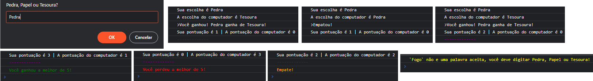

# The Odin Project Web Development
## Projeto: Rock Paper Scissors (Pedra Papel Tesoura)
Implementação simples do jogo Rock Paper Scissors (Pedra Papel Tesoura) do The Odin Project [Projeto](https://www.theodinproject.com/paths/foundations/courses/foundations/lessons/rock-paper-scissors).

Esse é o meu primeiro projeto com **HTML/CSS/JS**. **Site para o game** [Aqui](https://quelzynh0.github.io/pedra-papel-tesoura/).
### Primeira etapa do projeto | Jogo pelo console do navegador
**Os benefícios que obtive nesta etapa:**

* Conhecimento aprofundado de como **as funções JavaScript funcionam** umas com as outras.
* Utilização do **console.log()** para **debugar o código**.
* Aprendi a colorir os **textos do console**.

### Segunda etapa do projeto | Jogo com interface de usuário
**Os benefícios que obtive nesta etapa:**

* Conhecimento aprofundado de estilização com CSS e responsividade.
* Aprendi a manipulções básicas de estilo de elementos por meio de código JavaScript.
* Melhorei minha compreensão das funções JavaScript.

