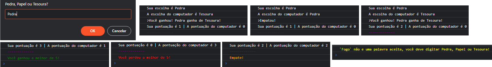

# The Odin Project Desenvolvedor Web
## Projeto: Rock Paper Scissors (Pedra Papel Tesoura)
Implementação simples do jogo Rock Paper Scissors (Pedra Papel Tesoura) do The Odin Project [Projeto](https://www.theodinproject.com/paths/foundations/courses/foundations/lessons/rock-paper-scissors).

Esse é o meu primeiro projeto com **HTML/CSS/JS**. **Site para o game** [Aqui](https://mooniidev.github.io/rock-paper-scissors-game/).
### Primerio Etapa do Projeto | Jogar pelo console do navegador
**Os benefícios que obtive nesta etapa:**

* Conhecimento aprofundado de como **as funções JavaScript funcionam** umas com as outras.
* Utilização do **console.log()** para **debugar o código**.
* Aprendi a colorir os **textos do console**.

